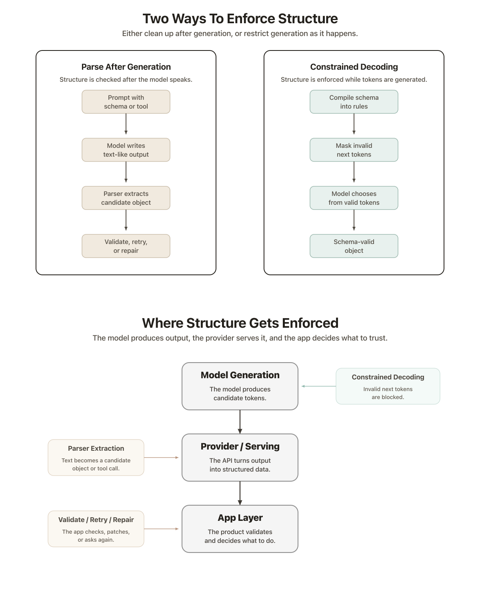

# Comparing Models for Time-Sensitive Structured Extraction

A key aspect of my `voice-todos` app was to make it snappy: visual feedback is useful only if it's near instant. 
So how do you get close to this `<500ms` that provides this human-level interaction feeling?
You need to optimize latency at all levels.

## Optimizing LLM extraction time

I built my own, very simple, eval suite, made of 26 cases, to test if LLMs were able to capture some behaviours expected from my `voice-todos-app`:
- Multi-todo extraction.
- Over- and under-splitting.
- Merge instructions following.
- Correction of previous todos.
- Cancellation.

Here are the experiments I ran:
- Thinking level: for Gemini Flash I tried to change the thinking level for both 3.0 and 3.1. Low thinking was faster in one case, slower in the other.
- Smaller models: I tried Mistral Small 4. The hypothesis was that smaller models would be faster proved correct. I also tried even smaller Qwen 3.5 models which branched into further experiments 
- DeepInfra output tool vs DeepInfra json_schema: output tool fails for smaller model sizes. json_schema has less requirements with regards to the model and achieves better results.
- DeepInfra json_schema vs Outlines structured extraction: it's unclear how DeepInfra implements json_schema. Outlines implements `constrained decoding`. 

The winner was Mistral Small 4: with a perfect score and `0.674s` average latency.
Latency is measured over the full case span, including failed runs.

| Setup | Count score | Avg latency | P95 latency |
|---|---:|---:|---:|
| Gemini 3 Flash / default | 26/26 | 3.055s | 4.251s |
| Gemini 3 Flash / minimal thinking | 26/26 | 1.430s | 3.420s |
| Gemini 3.1 Flash-Lite / default | 25/26 | 1.097s | 1.841s |
| Gemini 3.1 Flash-Lite / minimal thinking | 25/26 | 1.314s | 2.511s |
| Mistral Small 4 / default | 26/26 | 0.674s | 1.053s |
| Qwen 3.5 0.8B / DeepInfra output tool | 0/26 | 1.721s | 2.141s |
| Qwen 3.5 2B / DeepInfra output tool | 0/26 | 1.184s | 2.500s |
| Qwen 3.5 4B / DeepInfra output tool | 18/26 | 1.893s | 2.667s |
| Qwen 3.5 9B / DeepInfra output tool | 23/26 | 5.288s | 9.805s |
| Qwen 3.5 0.8B / DeepInfra provider json_schema | 13/26 | 0.552s | 1.105s |
| Qwen 3.5 2B / DeepInfra provider json_schema | 21/26 | 0.684s | 1.217s |
| Qwen 3.5 4B / DeepInfra provider json_schema | 19/26 | 0.934s | 1.856s |
| Qwen 3.5 9B / DeepInfra provider json_schema | 23/26 | 2.713s | 5.857s |
| Qwen 3.5 0.8B / Modal Outlines | 14/26 | 1.513s | 5.983s |
| Qwen 3.5 2B / Modal Outlines | 13/26 | 0.981s | 1.341s |
| Qwen 3.5 4B / Modal Outlines | 25/26 | 2.654s | 5.801s |
| Qwen 3.5 9B / Modal Outlines | 22/26 | 3.285s | 6.728s |

## How Structure Gets Enforced

There are 2 possible strategies to enforce the structure of an LLM response: 

### `parse-after-generation`
1. The provider shows the model a schema or a tool definition.
2. The model generates a text answer.
3. The provider parses the response to extract a schema-compliant json object.
4. The app validates the schema, retries or repairs the result if not ok.

### `constrained decoding`
1. The model is added a constrained decoding library such as Outlines.
2. The provider shows the model a schema 
3. The library turns the schema into rules that run during token generation
4. The model generates token as it normally would but the library `masks` invalid tokens so that only tokens that are schema-compliant may be chosen as an output.

