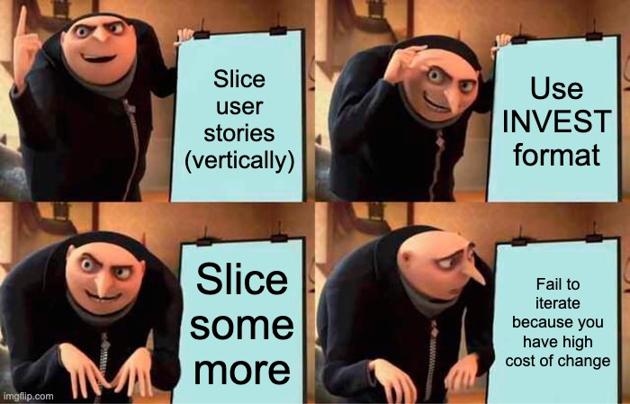

---
hooks:
  - https://imgflip.com/i/9xw3sb
  - https://tenor.com/fr/view/teppanyaki-chop-chopping-knife-skills-fast-hands-gif-15378421?utm_source=chatgpt.com
---

# The Slicing Fallacy

**Slice, baby, slice**
That's how you're going to iterate faster.
Or is it?

You sliced that feature into 3 iterations
But wait!
Iteration 2 implies to rework a lot that happened in iteration 1
Could we not just ship them together?

And actually, 3 releases, that's 3 times the overhead:
3 times the manual testing, the deployment and so on.
Can't we just do a single release?

**When 2 changes cost more than a larger one, you bundle.**
That's what Cost of Change does: 
The higher it is, the stronger the incentives to delay and to bundle.

**You cannot slice your way out of slow iterations**
That's the slicing fallacy.
You are slow because you have high cost of change
And slicing won't help as long as this remains true.

