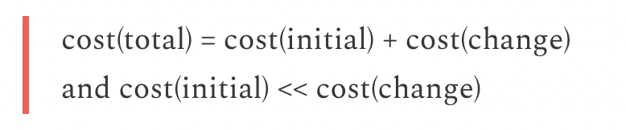

# Understanding Cost of Change

## Why it matters

If you look at a feedback loop, it's actually a back and forth between you and the world:
- (A) You push something into the world
- (B) The world responds to your proposal
[ADD IMAGE: someone trowing something at the world]

From inception to response, the length of your feedback loop is T(feedback) = T(A) + T(B)
There is some level of control on T(B), but you mostly have control on how fast you get to ship.

But "shipping" is a rather unspecific term. 
As Kent Beck [puts it](https://tidyfirst.substack.com/p/change):
- cost(software) = cost(initial) + cost(change)
- But since software is continuously evolving cost(software) ~= cost(change)



So, although the term Cost of Change is seldomly referenced, that's mostly what's at stake when we talk about:
> Shortening the feedback loop
> Shipping faster

But Cost of Change is also the best vantage point to consider the impact of AI and code generation.

So here is an article breaking it down. 
For myself, and for anyone interested.

## cost(software) ~= cost(change)

First I think it's worth contemplating what it means that cost(software) ~= cost(change).
To be complete: cost(total) = cost(initial) + cost(change)
But over the lifecycle of a software cost(initial) << cost(change)

That's assuming that cost(change) is low enough.
For the sake of the argument, let's consider the case where cost(change)=infinity
Meaning it's materially impossible to make a change. 
Then, what you can do is start over. 

When you build a bridge wrong, you may have to tear it down and rebuild it. 
The physical world has this property of generally having a high cost of change.

But software is different. 
Cost of change is significantly lower. 

But that does not mean it is insignificant, or fixed for everyone.
Quite the opposite actually.
It's a defining force. 
But strangely it looks like only XP bothers to care about it.

## What makes up the cost of change?

Again quoting Kent Beck, cost of change is the cost to understand, modify, validate and deploy
[ADD IMAGE]

This is the *software* cost of change.

If you consider that you are selling a product, you might add: 
- The cost of distribution
- The cost of adoption

**The distribution layer:**
- On-premise or embedded software updates (requires physical access or coordination, security audits,...)
- App store review processes

**The adoption layer:**
- User documentation updates
- Training materials and sessions
- Support team and partners enablement


## The mathematics of cost of change

Cost of change is **subadditive**: doing N changes separately costs more than doing them together.

This comes from two sources:

### 1. Fixed costs

Every change includes fixed overhead:
- Deployment costs (whether you change 1 line or 100 lines)
- Review processes
- Testing cycles
- Release communication

If deployment takes 2 hours, making 10 separate one-line changes costs 20 hours of deployment time. Making them together costs 2 hours.

**Implication:** High fixed costs incentivize bundling changes into larger releases.

### 2. Rework costs

When changes interact with each other:
- You might modify the same code twice
- Tests need updating multiple times
- Documentation requires multiple passes
- Users experience multiple disruptions

Unless you can slice work perfectly upfront (which requires big design upfront), some rework is inevitable with multiple iterations.

**Implication:** High rework costs incentivize getting it right the first time—which means more upfront planning.

### The equation

```
Cost(N changes separately) > Cost(N changes together)
```

The bigger the fixed costs and rework, the stronger this inequality.

This is why high cost of change naturally pushes you toward waterfall approaches, regardless of what methodology you claim to follow.

## The waterfall trap

When cost of change is high:
- You want to minimize the number of changes
- You want to bundle changes together
- You want to get it right the first time

All of this leads to:
- Big design upfront
- Extensive planning and specification
- Larger releases
- Fewer iterations

**The trap:** These behaviors make cost of change even higher, because:
- Larger changes have more surface area for errors
- Long gaps between releases mean more drift
- Big bang releases are riskier to deploy
- Upfront planning becomes self-justifying overhead

----

HOOK
2 important things : 
1. talk to users / customers
2. Keep cost of change low (that's how you keep iterating fast)

gaussian talk to users + ship fast -> frameworks -> talk to users + keep cost of change low (that's XP)