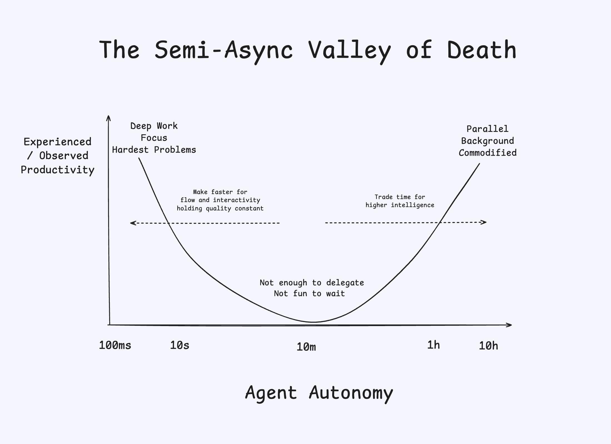

# The semi-async valley of death

Cognition published this great diagram on their blog, although buried at the end of a technical post. 
It deserves more attention.
 
There are already 2 classes of models: 
- The fast ones (Haiku and all *-mini or *-nano models)
- The accurate ones (Sonnet, o3 then GPT5-Thinking,...)

Fast models have taken a backseat so far:
The race between frontier models has been about accuracy: we have been happily trading speed for higher accuracy.

And we'll keep making that tradeoff until models reach a threshold from which the marginal value of accuracy starts declining.
That's when we'll see the field split into 2 categories of models, at both end of the spectrum on cognition's sketch:
- The Oracles: slow but accurate on larger and larger scopes. They are used asynchronously.
- The Pair-programmers: fast and accurate on smaller scopes. They allow for interactive collaboration.

It's unclear where's that threshold.
Some people seem to be ready to adopt GLM 4.6 or Haiku 4.5 claiming they are accurate enough and their speed offers a different much more focused approach. 