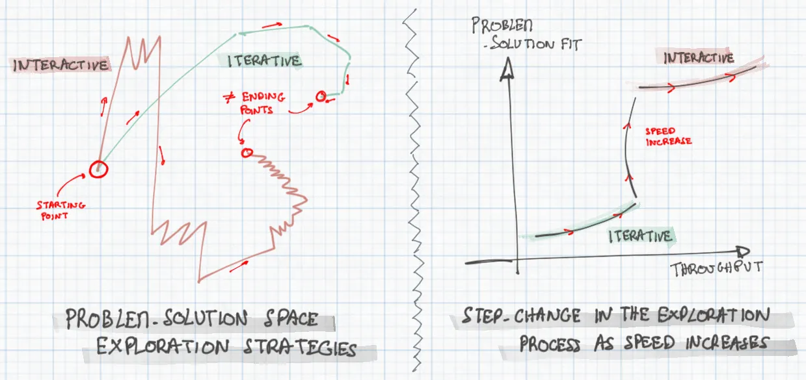

# Markdown Styling Test Article

This article contains all possible Markdown elements to test CSS styling on the website. It includes headers, text formatting, lists, code blocks, tables, images, and more.

## Headers

### Level 3 Header
#### Level 4 Header
##### Level 5 Header
###### Level 6 Header

## Text Formatting

This is a paragraph with **bold text**, *italic text*, and ***bold italic text***. You can also use __bold__ and _italic_ alternative syntax.

Here's text with ~~strikethrough~~, `inline code`, and a [link to the website](https://meaningfool.github.io/).

### Emphasis and Strong

*This text is emphasized*
**This text is strong**
***This text is both***

## Lists

### Unordered Lists

- First item
- Second item
  - Nested item
  - Another nested item
    - Deeply nested item
- Third item

### Ordered Lists

1. First numbered item
2. Second numbered item
   1. Nested numbered item
   2. Another nested numbered item
      1. Deeply nested numbered item
3. Third numbered item

### Mixed Lists

1. Ordered item
   - Unordered nested item
   - Another unordered item
2. Another ordered item
   1. Nested ordered item
   - Mixed with unordered

## Code Blocks

### Inline Code

Use `console.log()` to print output, or call `fetch()` for API requests.

### Code Blocks

```javascript
function publishArticle(title, content) {
  const article = {
    title: title,
    content: content,
    publishedAt: new Date()
  };

  return api.publish(article)
    .then(response => {
      console.log('Article published successfully!');
      return response;
    })
    .catch(error => {
      console.error('Failed to publish:', error);
      throw error;
    });
}
```

```bash
# Bash commands
git add .
git commit -m "Add new article"
git push origin main
/publish
```

```python
def validate_frontmatter(file_path):
    """Validate that a markdown file has required frontmatter."""
    with open(file_path, 'r') as file:
        content = file.read()

    if not content.startswith('---'):
        return False

    # Extract frontmatter
    parts = content.split('---', 2)
    if len(parts) < 3:
        return False

    frontmatter = parts[1].strip()
    return 'title:' in frontmatter and 'date:' in frontmatter
```

## Blockquotes

> This is a simple blockquote.

> This is a blockquote with multiple paragraphs.
>
> This is the second paragraph in the blockquote.

> This is a nested blockquote example.
>
> > This is a nested quote inside the main quote.
> > It can span multiple lines too.
>
> Back to the main quote level.

### Blockquote with Other Elements

> **Bold text in a blockquote**
>
> - List item in blockquote
> - Another list item
>
> `Inline code` in blockquote
>
> ```javascript
> // Code block in blockquote
> console.log('Hello from blockquote!');
> ```

## Tables

### Simple Table

| Header 1 | Header 2 | Header 3 |
|----------|----------|----------|
| Row 1, Col 1 | Row 1, Col 2 | Row 1, Col 3 |
| Row 2, Col 1 | Row 2, Col 2 | Row 2, Col 3 |

### Aligned Table

| Left Aligned | Center Aligned | Right Aligned |
|:-------------|:--------------:|--------------:|
| Left text | Center text | Right text |
| Another row | More centered | Right side |
| Final row | Last center | End right |

### Table with Formatting

| Feature | Status | Description |
|---------|--------|-------------|
| **Validation** | ✅ Complete | `frontmatter-validation.sh` checks all content |
| **Publishing** | ✅ Complete | `/publish` command handles full workflow |
| *Testing* | 🚧 In Progress | CSS styling verification needed |
| ~~Old Method~~ | ❌ Deprecated | Manual workflow replaced |

## Horizontal Rules

---

Content above the rule.

***

Content between rules.

___

Content below the rule.

## Links and Images

### Links

- [External link](https://github.com/meaningfool/meaningfool-writing)
- [Link with title](https://meaningfool.github.io/ "My Personal Website")
- [Reference link][ref-link]
- <https://example.com> (automatic link)

[ref-link]: https://docs.github.com/en/get-started/writing-on-github/getting-started-with-writing-and-formatting-on-github/basic-writing-and-formatting-syntax

### Images

Here's a local image to test image styling:



*This image tests how local images are displayed, sized, and styled on the website.*

## Task Lists

- [x] Create comprehensive Markdown test article
- [x] Include all major Markdown elements
- [ ] Test CSS styling on website
- [ ] Update styles if needed
- [ ] Verify responsive design

### Nested Task Lists

- [x] Main task completed
  - [x] Subtask 1 completed
  - [x] Subtask 2 completed
  - [ ] Subtask 3 pending
- [ ] Another main task
  - [ ] Subtask A
  - [ ] Subtask B

## Special Characters and Escaping

These characters need escaping: \* \_ \\ \` \{ \} \[ \] \( \) \# \+ \- \. \!

You can use HTML entities: &copy; &trade; &reg; &mdash; &ndash; &hellip;

## HTML Elements (if supported)

<details>
<summary>Click to expand details</summary>

This content is hidden by default and can be expanded by clicking the summary.

- It can contain **any Markdown**
- Including lists and `code`
- And other formatting

</details>

<kbd>Ctrl</kbd> + <kbd>C</kbd> to copy, <kbd>Ctrl</kbd> + <kbd>V</kbd> to paste.

<mark>Highlighted text</mark> if the CSS supports it.

## Footnotes (if supported)

This text has a footnote[^1].

This text has another footnote[^note].

[^1]: This is the first footnote.
[^note]: This is a named footnote with more detailed content.

## Definition Lists (if supported)

Term 1
: Definition for term 1

Term 2
: Definition for term 2
: Another definition for term 2

## Mathematical Expressions (if supported)

Inline math: $x = y + z$

Block math:
$$
\sum_{i=1}^{n} x_i = x_1 + x_2 + \cdots + x_n
$$

## Conclusion

This article contains virtually every Markdown element to help test CSS styling. Use this to verify that all elements render correctly on the website and adjust styles as needed.

### Testing Checklist

When reviewing this article on the website, check:

1. **Typography**: Font sizes, weights, line heights for all header levels
2. **Code styling**: Syntax highlighting, background colors, font families
3. **Lists**: Proper indentation, bullet styles, numbering
4. **Tables**: Borders, alignment, responsive behavior
5. **Blockquotes**: Visual distinction, nested quote styling
6. **Links**: Colors, hover states, visited states
7. **Images**: Sizing, alignment, captions
8. **Spacing**: Margins and padding between elements
9. **Mobile responsiveness**: How elements adapt to smaller screens
10. **Dark/light mode**: If supported, test both themes