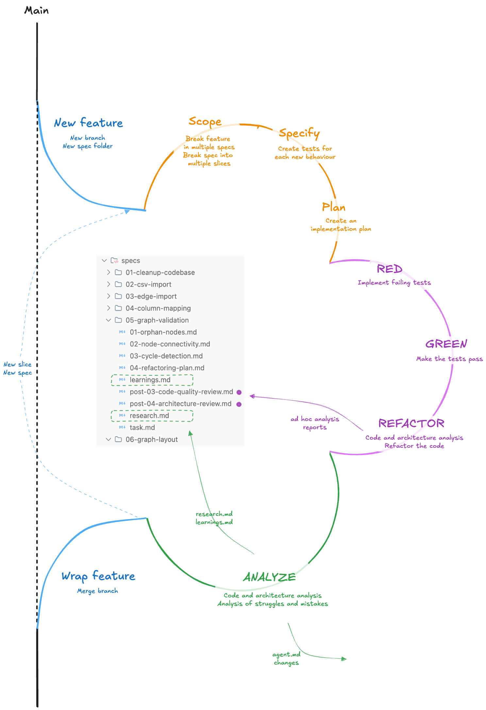
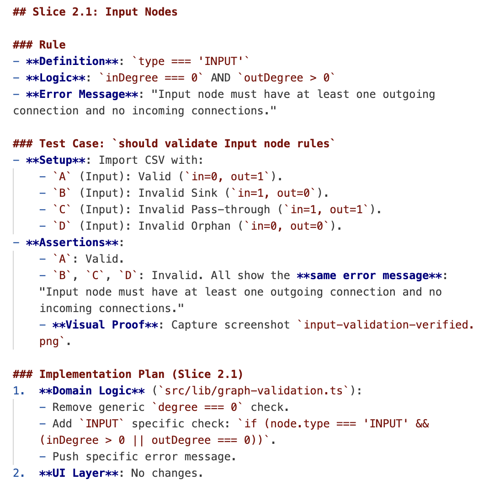

# Compounding Development Process

I recently picked up and finished a [data lineage project](../articles/2025-12-22-antigravity_is_onto_something.md).

I wanted to 
- **Make the most of this learning opportunity** and be able to report on my learnings (learn in public).
- **Build a robust and consistent process** that would prevent me from "vibing" into a wall as happened when I first worked on this project last July.
- **Build a self-improving process**

This diagram captures the flow as it stands today:

The process is structured into three main phases, bookended by a "Getting Started" and "Finishing" step.

## Starting a new feature

Each feature starts with:
- Its dedicated **branch**
- A corresponding **folder in the `specs` directory**: it will host all the documentation for the feature: specifications, research, learnings and ad hoc audit reports.

## Phase 1: Planning & Slicing

**I wanted from the start to use TDD**: 
- I believe it's a virtuous process
- Even more so when the goal is learning
- Even more so when **using AI**: making baby steps and using tests as the source of truth prevents from drowning in the amount of code (and slop) that AI inevitably creates.

**Step 1: Break it down**: 
- **Identify the baby steps**, the most atomic changes in behavior of the app from the user perspective. 
- If the feature is too large for a single spec, create **multiple specs** (named `01-my-first-spec.md`, `02-second-spec.md`)
- Within a spec, break things down into **slices**. Each slice should add one new behavior or a very limited number of cohesive behaviors. At the end of each slice, we ought to have a working piece of software. 

**Step 2: Define expectation through tests**: 
- **In TDD, tests are the source of truth**, not the code. That's where the expected behaviors are encoded.
- Each change in behavior is testable. 
- We (the AI and I) define the set of **E2E tests** that will verify the behavior.

**Step 3: Plan the implementation**: 
- Only once the tests are defined do we consider the implementation plan and details. 
- Practically, the AI has a very hard time reasoning separately about the implementation and the tests. 
- But clear tests remove ambiguity and allow the AI to course correct during the implementation phase.

## Phase 2: Implementation

The implementation phase is strictly TDD-inspired:

**RED**: 
- We implement the tests first and confirm they fail. 
- This validates that our tests are actually testing something.

**GREEN**: We implement the code to make the tests pass.

**REFACTOR**: 
- This is where we pause. When one or multiple specs have been implemented, I ask the model to take a step back. We look at the app from different perspectives—code quality, architecture, consistency, and identify refactoring needs.
- Audit reports are stored in the spec folder, e.g. `post-03-code-quality-review.md`.
- Small improvements are tackled right away.
- Larger refactoring result in a new spec.

## Phase 3: Analysis & Continuous Learning

**The research**: 
- Throughout the process—whether planning, implementing, or debugging—we log our findings in `research.md`. 
- We are basically extracting from the chats the insights that we want to preserve both for agents that would need to makes changes to the feature later, and for the humans to understand the context behind design and implementation decisions. 

**The learnings**: 
- As part of my learning in public process, I want to be able to report on my learnings (captured in my daily logs)
- Learnings are extracted from the research and distilled into `learnings.md`, to which I add my own observations and insights.

**The retro**: 
- Some of the insights relate to the development process itself.
- This leads to improving `agent.md` and other documentation files, or creating new workflow commands (slash commands in CC)

## Wrapping Up

At the end of a spec: 
- Either we identify new work within the current feature that results in new slices or new specs
- Or the feature is done and we merge the branch

The cycle completes when the feature is done. We merge the branch. Or, if the process revealed more work, we might identify new slices for the current spec, create new specs for the ongoing feature, or add items to the backlog.

It’s a rhythm of expanding and contracting scope, but always moving forward with a working piece of software.

## Conclusion

The result is a process that compounds learnings and process improvements over time.

That's what Every coined as [Compounding Engineering](https://every.to/c/compounding-engineering). 

And Lance Martin created his own [process using "diaries"](https://rlancemartin.github.io/2025/12/01/claude_diary/).