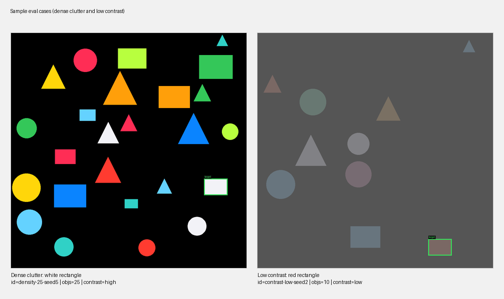
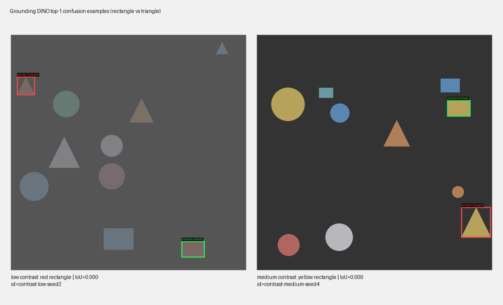
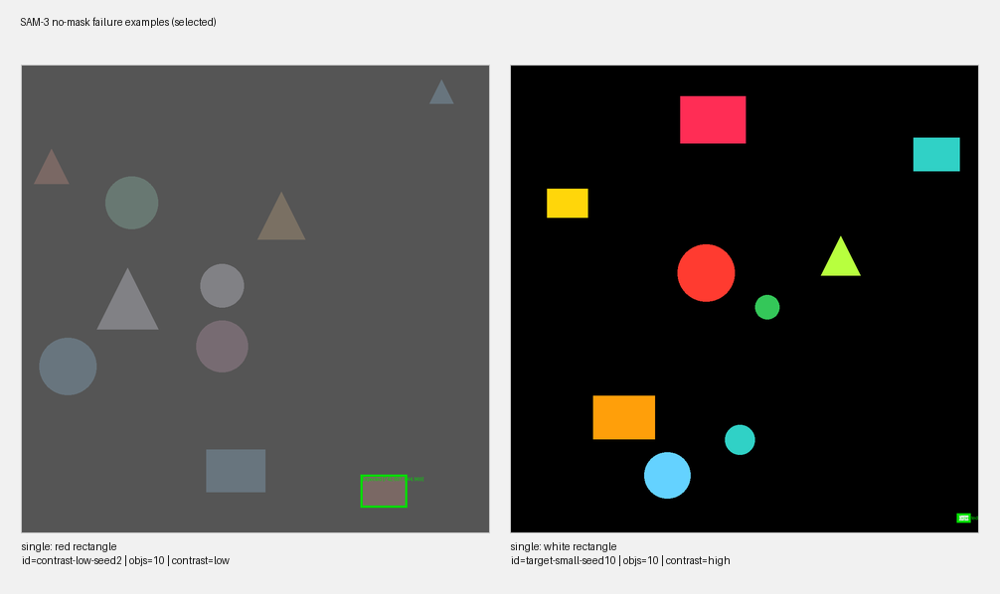

# Giving Agents the Ability to Point at Things 👉

**Working on illustrations revealed an unexpected limitation**: I worked with Nano Banana to create illustrations for my [Agent Frameworks for the Rest of Us](https://agent-frameworks-report.meaningfool.net/) report, and I tried to have Claude Code make programmatic edits on generated images such as resizing or repositinoning some elements. But that turned out to be very tedious, Claude Code being very imprecise.

**Agents/LLM can't locate what they see on images.** Claude Code can "see" the image, it can describe it and its constitutive elements and their relative positioning, i.e. the composition of the image. But when you ask it to "select" an element, it fails quite miserably: the bounding box it produces is in the vicinity of the element but far enough off to be useless for pixel-level edits.

**So how can we make agents better at locating things on an image?** Can we provide them with a "selection" tool that fixes the problem, like a calculator removes the need for LLMs to guess the results of arithmetic operations.

I tested the following approaches:
- **DINO model** (2023): a zero-shot object detection model
- **DINO + Skill**: DINO augmented by a specific skill to compensate for its failure modes
- **SAM3** (2025): the recent release of Segment Anything Model by Meta that does mask detection from prompts 

---

## Eval-based approach

**I needed a way to benchmark different ideas.** So I built a small eval harness that runs "selection" tasks against simple images populated with geometric shapes (circles, rectangles, triangles). The dataset is generated programmatically, and each case associates:
- An image
- A query ("blue circle," "small red triangle")
- A ground-truth bounding box.

**Two datasets, two difficulty levels:**
- **Single-factor** (59 cases): varies one parameter at a time — canvas size, object count, target size, contrast level. The goal is to isolate what factors matter.
- **Combined-factors** (31 cases after filtering ambiguous ones): stacks multiple hard factors together. Small targets on large canvases with low contrast and dense clutter.

**The metric is IoU** (intersection over union) — how much the predicted bounding box overlaps with the expected one.

---

## Baselines: models without tools

| Mode | Single-factor (IoU) | Combined-factors (IoU) | Failures |
|------|:-------------------:|:------------:|:--------:|
| Claude Sonnet (direct API) | 0.65 | 0.25 | 0% |
| Gemini Flash (direct API) | 0.62 | 0.50 | 2% |
| Claude Code harness (baseline) | 0.58 | 0.19 | 1% |

---

## Grounding DINO: good candidates, bad ranking

**[Grounding DINO](https://github.com/IDEA-Research/GroundingDINO) is a specialized open-vocabulary object detector.** Given an image and a text query, it returns bounding box candidates ranked by confidence. It's available on [Replicate](https://replicate.com/adirik/grounding-dino)

**Results: on its own, DINO underperformed the LLM baselines:**

| Mode | Single-factor (IoU) | Combined-factors (IoU) | Failures |
|------|:-------------------:|:------------:|:--------:|
| Claude Code harness (baseline) | 0.58 | 0.19 | 1% |
| Grounding DINO (top-1) | 0.53 | 0.18 | 0% |

**But the issue is ranking, not detection.** Looking at DINO's top-5 candidates, the correct bounding box is in there ~84% of the time. The problem: DINO's confidence score doesn't reliably surface the best match.

---

## The skill: closing the agent loop

**DINO and Claude Code had non-overlapping failure modes**:
- Claude Code is good at spatial reasoning but cannot draw a bounding box
- DINO identifies precise bounding boxes but can't reason about which one is the expected one.

**The skill closes the loop**:
1. It calls Grounding DINO which output its top 5 predictions
2. The 5 bounding boxes are drawn on top of the image 
3. Claude Code picks one candidate from overlay image

**Results**

| Mode | Single-factor (IoU) | Combined-factors (IoU) | Failures |
|------|:-------------------:|:------------:|:--------:|
| Claude Code harness (baseline) | 0.58 | 0.19 | 1% |
| Grounding DINO (top-1) | 0.53 | 0.18 | 0% |
| **Harness + skill** | **0.82** | **0.35** | **0%** |

---

## SAM-3: precise when it answers

[SAM-3](https://ai.meta.com/sam2/) segments the image into regions and matches them to the prompt.

Results:
- **When SAM returns a result, it is remarkably precise.** 
- **But in 21% of cases SAM returned no masks at all.** The model didn't produce any segmentation for the query.

| Mode | Single-factor (IoU) | Combined-factors (IoU) | Failure rate |
|------|:-------------------:|:----------------------:|:------------:|
| SAM-3 (when it answers) | 0.97 | 0.95 | — |
| SAM-3 (overall) | 0.79 | 0.70 | 21% |
| Harness + skill | 0.82 | 0.35 | 0% |

**SAM-3 failure modes:** SAM-3 fails mostly 
1. When there is low contrast which distorts the "colors" and 
2. When it is supposed to detect a shape of "lime" color.

**Hypothesis:** failures might be resolved through better prompting, as SAM-3 is probably able to detect the expected shapes but may fail to match some colors in the prompt with the corresponding color in the image.

---

## What to keep in mind

**The object-selection problem is similar to the letter-counting one.** LLMs can be great at the semantic level but fail at operating on the details (of words or images). And tools are here to the rescue.

**Will multimodal models get better at localization natively?**
1- Gemini Flash 3.0 already showed solid localization capabilities in this eval. I did not test Gemini 3.1, but if it keeps getting better, the common case gets absorbed into native capabilities. Specialized detectors like DINO or SAM get pushed toward edge cases.
2- If object selection remains a weak spot, interfacing LLMs with SAM-3 or other small image models will keep making sense.
